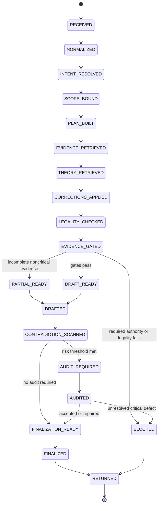
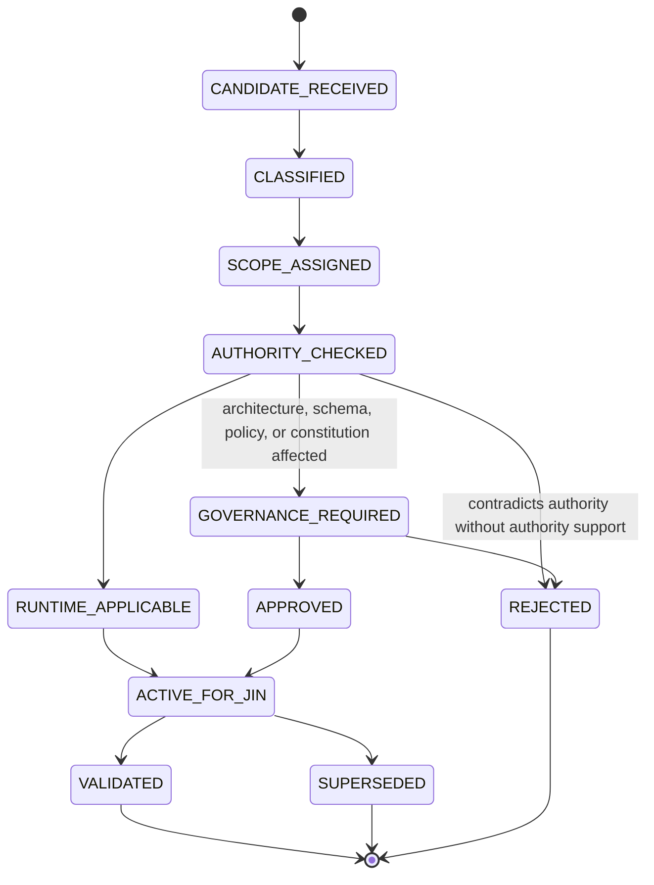
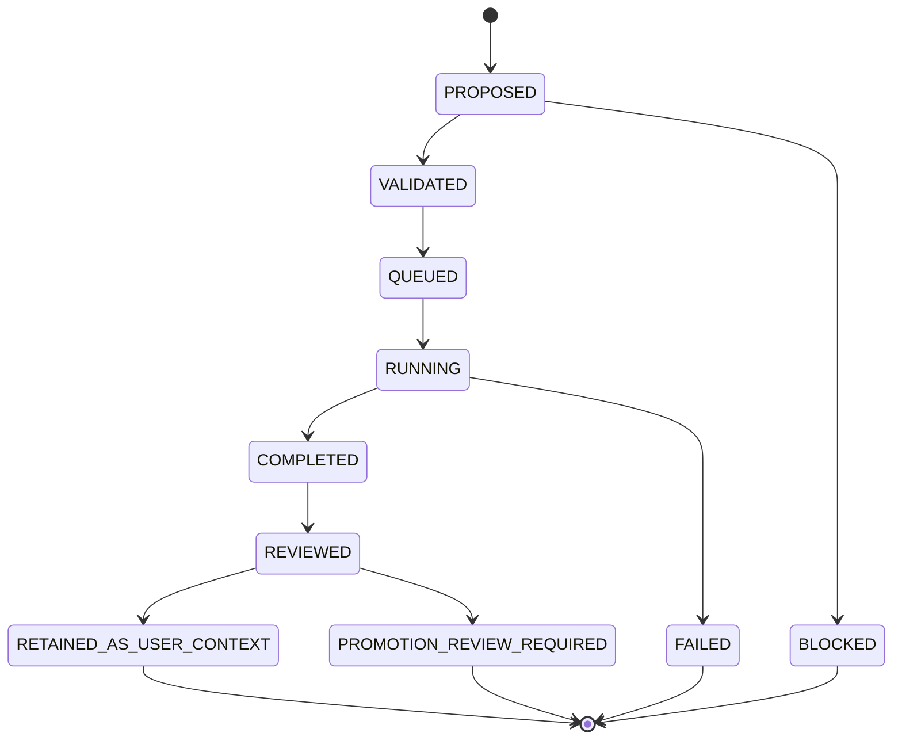
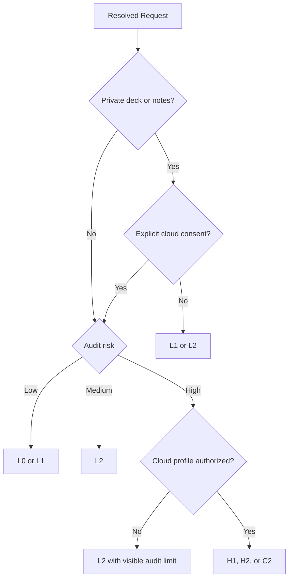

This specification extends the attached Constitution’s Section 24 into an implementable subsystem contract. The Constitution is still a non-authoritative comparison draft, so this document defines proposed behavior but does not authorize implementation or supersede accepted phase contracts. fileciteturn0file0

:::writing{variant="document" id="74261"}
# Jin-Gitaxias Strategist Subsystem Specification

**System:** Codie V2
**Subsystem:** Jin-Gitaxias Strategist
**Status:** Design and implementation-contract draft
**Implementation status:** Not claimed
**Authority status:** Non-authoritative until approved through Codie governance
**Primary constraint:** Jin may reason over evidence but may not mutate evidence, measurements, confidence records, or persisted recommendations.

---

# 1. Executive Definition

Jin-Gitaxias is Codie’s governed conversational strategy subsystem.

It converts a user question, selected deck context, canonical evidence, measured analytics, theory sources, rules authority, simulation reports, source conflicts, and prior corrections into a traceable answer packet.

Jin is not:

- an alternate analytics engine;
- an alternate recommendation engine;
- an autonomous deck editor;
- a provider or scraper;
- a canonicalization service;
- a rules authority;
- a confidence calculator;
- a path around Decision Intelligence;
- a model permitted to write into evidence repositories.

Jin may explain, compare, infer, challenge, propose experiments, and discuss strategic implications. Every such action remains downstream of Codie’s authority, evidence, legality, correction, and privacy controls.

The final system equation is:

```text
Jin Answer =
    Resolved User Intent
  + Bound Scope
  + Canonical Evidence References
  + Measured Evidence References
  + Theory Context
  + Applicable User Context
  + Applicable Corrections
  + Legality Report
  + Evidence-Gate Decisions
  + Contradiction Scan
  + Writer Output
  + Optional Auditor Output
  + Deterministic Finalization
```

No model output becomes canonical evidence merely because it is persuasive, articulate, or written with the traditional confidence of a machine that has never had to shuffle a hundred-card deck.

---

# 2. Constitutional Constraints

The following constraints are mandatory.

## 2.1 Read permissions

Jin may read through approved interfaces:

- Class 0 authority;
- canonical source observations;
- Class 2 measured evidence;
- Unified Evidence Objects;
- Decision Intelligence outputs;
- primer context;
- theory-corpus records;
- user context;
- immutable deck snapshots;
- simulator reports;
- source-conflict records;
- the user correction ledger;
- rules and legality reports.

Jin must receive references or bounded projections. It must not receive unrestricted database access.

## 2.2 Absolute write prohibitions

Jin may never create, update, delete, reinterpret, or supersede:

- canonical tournament evidence;
- canonical event or deck records;
- raw source records;
- canonical card identity;
- measured metrics;
- metric populations;
- metric formulas or versions;
- source-agreement tables;
- confidence tables;
- commander staples;
- frequency pools;
- package statistics;
- co-occurrence or co-dependence results;
- simulator result history;
- persisted recommendations;
- recommendation confidence;
- validation status;
- governance records.

This prohibition applies to:

- the writer model;
- the auditor model;
- the orchestration service;
- the Jin local API;
- UI-generated actions;
- plugins;
- cloud profiles;
- experiment generation.

A blocked mutation attempt must produce a security event and fail closed.

## 2.3 Permitted writes

Through separately authorized repositories, Jin may create:

- conversation summaries;
- deck-specific hypotheses;
- experiment queue items;
- user testing notes;
- theory notes;
- lesson-progress records;
- correction candidates;
- user-approved correction records;
- answer packets and their provenance;
- references to existing Decision Intelligence recommendations.

Every permitted write must be typed as user context, theory context, experimental context, or conversational history. None may enter canonical analytics populations.

## 2.4 Recommendation boundary

Jin may:

- explain an existing Decision Intelligence recommendation;
- compare its supporting and contradictory evidence;
- discuss a card as a hypothesis;
- identify a candidate worth testing;
- generate an experiment proposal;
- state that available evidence favors one option under declared assumptions.

Jin may not:

- independently persist a recommendation;
- assign recommendation confidence;
- alter Decision Intelligence weights;
- present an experimental hypothesis as an approved recommendation;
- silently turn correlation, theory, or anecdote into a recommendation.

Every candidate discussed without a Decision Intelligence record must be labeled:

```text
discussion_status = HYPOTHESIS | TEST_CANDIDATE | THEORY_APPLICATION
```

It must not be labeled `RECOMMENDATION`.

---

# 3. Existing Foundations and Completion Gaps

The following foundations are treated as existing design or implementation work because they were named in the project request. Their actual repository completeness must be audited before Codex modifies them.

| Foundation | Required retained behavior | Remaining work for complete Jin |
|---|---|---|
| Query planning | Converts a question into retrieval work | Add typed intent, scope locks, theory requirements, legality risk, privacy profile, audit requirements, and deterministic plan serialization |
| Evidence retrieval | Retrieves approved evidence | Add authority-first routing, snapshot binding, theory retrieval, correction overlays, provenance completeness, and population validation |
| Answer building | Produces a response from retrieved material | Separate claim ledger, prose draft, deterministic packet finalization, UI projection, and persistence projection |
| Source-conflict handling | Preserves conflicting source values | Add contradiction severity, authority precedence, draft-to-source comparison, scope mismatch detection, and mandatory disclosure rules |
| Unsupported-card handling | Identifies unsupported or unresolved cards | Add claim dependency tracking, partial-answer rules, legality blocking, simulator limitation propagation, and unsupported-card UI output |
| Local API | Exposes Jin functionality locally | Add typed endpoints, capability restrictions, idempotency, localhost defaults, authentication, privacy controls, and write separation |
| Writer/auditor boundaries | Separates answer generation and review | Add separate permissions, input bundles, risk-based audit policy, deterministic finalizer, auditor failure behavior, and cloud-profile restrictions |

Codex must inspect these foundations before proposing replacements. Duplicate subsystems would create two nearly identical paths with subtly different behavior, which is how software becomes folklore.

---

# 4. Design Goals

The complete Jin subsystem must:

1. Resolve what the user is actually asking.
2. Bind the answer to the correct deck, snapshot, date, region, population, and analysis profile.
3. Retrieve authority and measured evidence before contextual material.
4. Retrieve relevant theory for substantive strategic answers unless the user explicitly disables theory.
5. Apply user corrections at the narrowest valid scope.
6. validate card identity, format legality, historical legality, color identity, and interaction legality where relevant.
7. classify every material claim by evidence type.
8. prevent unsupported claims from reaching the final answer.
9. preserve material contradictions.
10. distinguish measured evidence, source opinion, theory, user experience, inference, and speculation.
11. generate experiments without presenting them as evidence.
12. support local-only operation.
13. disclose cloud processing before private data leaves the machine.
14. expose a complete final answer packet even when the default UI collapses most fields.
15. remain unable to mutate protected data.

---

# 5. Non-Goals

The subsystem does not implement:

- a full multiplayer Magic rules engine;
- arbitrary Oracle-text execution;
- new analytics formulas;
- canonical event deduplication;
- provider acquisition;
- metric calculation;
- confidence calculation;
- recommendation scoring;
- automatic deck changes;
- autonomous simulator execution without an approved experiment or simulation interface;
- automatic promotion of corrections into constitutional rules;
- cloud dependence;
- training a foundation model;
- public multi-user SaaS behavior.

---

# 6. System Components

## 6.1 Conversation Gateway

Receives the user request and current UI context.

Responsibilities:

- assign a request identifier;
- normalize encoding and message structure;
- validate input size;
- attach authorized UI context;
- distinguish user text from retrieved source text;
- prevent retrieved documents from being interpreted as user instructions;
- reject attempts to invoke protected write capabilities.

Input:

```text
User message
Optional selected deck
Optional selected snapshot
Optional selected report
Optional explicit filters
Optional model profile
Optional theory override
```

Output:

```text
JinRequest
```

## 6.2 Intent Resolver

Determines the primary and secondary intents.

It must not perform evidence retrieval or generate strategic conclusions.

## 6.3 Scope Binder

Determines the exact analytical scope:

- global;
- format;
- commander;
- partner pair;
- archetype;
- deck identity;
- deck snapshot;
- event;
- region;
- local metagame;
- historical date;
- selected population;
- simulator run;
- theory-only discussion.

The Scope Binder prevents a deck-specific correction from contaminating commander-wide or format-wide reasoning.

## 6.4 Query Planner

Creates a deterministic retrieval and validation plan.

The plan specifies:

- evidence required;
- evidence optional;
- theory topics;
- rules checks;
- legality checks;
- correction scopes;
- conflict sets;
- unsupported-card dependencies;
- auditor requirement;
- privacy classification;
- permitted answer modes.

## 6.5 Evidence Retriever

Retrieves approved evidence references.

It may not:

- query unapproved providers directly;
- calculate metrics;
- resolve conflicts by guessing;
- write to repositories;
- return source records outside the authorized request scope.

## 6.6 Theory Retriever

Retrieves attributed theory claims, frameworks, counterarguments, and applicability limits.

Theory retrieval is mandatory by default for substantive strategic questions. It may be suppressed only by an explicit user request or by a question that is purely factual, navigational, or administrative.

## 6.7 Correction Resolver

Loads and orders applicable corrections.

It applies corrections to the runtime reasoning context without mutating the evidence the correction discusses.

## 6.8 Legality Service

Performs authority-backed identity and legality checks.

It returns a report. It does not rewrite the answer itself.

## 6.9 Evidence Gate

Determines which claims the writer is allowed to make.

It assigns:

- allowed claim classes;
- required labels;
- confidence ceiling references;
- blocked claims;
- mandatory caveats;
- required contradiction disclosures.

## 6.10 Writer

Produces a structured draft from the approved answer bundle.

The writer has no persistence capability and no access to protected repositories.

## 6.11 Contradiction Scanner

Compares draft claims against:

- authority;
- retrieved evidence;
- source conflicts;
- correction records;
- deck scope;
- legality findings;
- theory disagreements;
- recommendation boundaries.

It operates after drafting because contradictions can be introduced by wording even when retrieval was correct.

## 6.12 Adversarial Auditor

Reviews high-risk answers.

It may identify defects and propose revisions. It cannot directly finalize or persist an answer.

## 6.13 Deterministic Finalizer

Applies gate and audit decisions to create the final packet.

The finalizer, not the writer, determines:

- which claims survive;
- which labels appear;
- which warnings are mandatory;
- whether the response is complete, partial, blocked, or failed;
- whether an experiment proposal may be attached.

## 6.14 Permitted-Write Service

Persists only explicitly allowed Jin outputs.

It must have no repository dependency on canonical evidence, analytics, confidence, or recommendation tables.

---

# 7. Core Request Lifecycle



No state transition grants protected write authority.

---

# 8. Intent Resolution

## 8.1 Intent taxonomy

A request may contain one primary intent and multiple secondary intents.

```text
FACT_RETRIEVAL
RULES_EXPLANATION
LEGALITY_CHECK
CARD_ANALYSIS
CARD_COMPARISON
COMMANDER_COMPARISON
DECK_ANALYSIS
DECK_HEALTH_DISCUSSION
PACKAGE_ANALYSIS
COMBO_OR_LINE_ANALYSIS
TUTOR_PILE_CERTIFICATION
MATCHUP_ANALYSIS
TOURNAMENT_PREPARATION
META_INTERPRETATION
SIMULATION_INTERPRETATION
THEORY_EXPLANATION
PHILOSOPHER_QUORUM
EXPERIMENT_GENERATION
LESSON_DELIVERY
CORRECTION_SUBMISSION
CORRECTION_REVIEW
DECISION_INTELLIGENCE_EXPLANATION
SOURCE_COMPARISON
```

## 8.2 Resolved intent fields

```text
request_id
primary_intent
secondary_intents
requested_subjects
requested_action
answer_depth
deck_scope
time_scope
region_scope
population_scope
historical_legality_date
analysis_profile
theory_mode
simulation_context
decision_intelligence_reference
privacy_class
model_profile
legality_risk
audit_risk
unresolved_terms
```

## 8.3 Theory modes

```text
DEFAULT_REQUIRED
EXPLICITLY_REQUIRED
EXPLICITLY_SUPPRESSED
NOT_APPLICABLE
UNAVAILABLE
```

Project default:

- Strategic analysis uses `DEFAULT_REQUIRED`.
- Pure card text, legality, source lookup, or API administration may use `NOT_APPLICABLE`.
- Jin must not silently omit theory because retrieval failed. It must use `UNAVAILABLE` and disclose the failure.

## 8.4 Ambiguity behavior

If ambiguity affects only presentation, Jin proceeds with a declared assumption.

If ambiguity affects card identity, legality, deck identity, or population:

- the unresolved item remains explicit;
- dependent claims are blocked;
- unrelated supported analysis may continue;
- the packet is marked partial.

Jin must never silently map an unresolved card name to the nearest recognizable card.

---

# 9. Scope Resolution

## 9.1 Scope hierarchy

```text
FORMAT
  -> COMMANDER OR PARTNER PAIR
    -> ARCHETYPE
      -> DECK IDENTITY
        -> IMMUTABLE DECK SNAPSHOT
          -> EXPERIMENTAL VARIANT
```

Additional orthogonal scopes:

```text
GLOBAL
REGIONAL
LOCAL META
EVENT
DATE WINDOW
HISTORICAL DATE
SIMULATION RUN
THEORY SOURCE SET
```

## 9.2 Scope precedence

For the current answer:

1. Explicit scope in the current request.
2. Explicitly selected UI object.
3. Selected immutable deck snapshot.
4. Applicable snapshot-level correction.
5. Applicable deck-level context.
6. Commander or archetype context.
7. Format context.
8. Global context.

A narrower scope may override a broader user-context assumption. It may not override authority or canonical evidence.

## 9.3 Snapshot binding

Every deck-specific answer must identify:

- snapshot ID;
- deck hash;
- commander signature;
- source URL where applicable;
- snapshot time;
- whether a newer snapshot exists;
- unsupported or unresolved cards;
- analysis version.

If no immutable snapshot exists, the answer must be labeled as list-text or provisional analysis.

---

# 10. Query Plan Contract

## 10.1 Query plan structure

```text
plan_id
request_id
intent
scope
required_retrievals[]
optional_retrievals[]
authority_checks[]
metric_references[]
theory_queries[]
correction_scopes[]
conflict_queries[]
legality_checks[]
unsupported_dependency_checks[]
decision_intelligence_reads[]
simulation_reads[]
privacy_policy
writer_profile
auditor_policy
expected_output_sections[]
failure_policy
plan_version
plan_hash
```

## 10.2 Required retrieval order

```text
1. Card and object identity
2. Rules and legality authority
3. Deck snapshot
4. Canonical evidence
5. Measured evidence
6. Existing Decision Intelligence output, when referenced
7. Source conflicts
8. Simulator reports
9. User context
10. Corrections
11. Primer and community context
12. Theory corpus
```

The order defines precedence, not necessarily physical query sequence.

## 10.3 Plan validation

A plan is invalid when it:

- requests a protected write;
- retrieves metrics without population metadata;
- requests private data under a cloud profile without authorization;
- omits legality checks for a legality-sensitive claim;
- omits the deck snapshot for a deck-specific claim;
- treats theory or community context as measured evidence;
- asks the writer to calculate a new metric;
- asks the writer to invent missing evidence.

---

# 11. Evidence Retrieval

## 11.1 Retrieval bundle

```text
RetrievalBundle
    authority_refs
    card_identity_refs
    legality_refs
    canonical_observation_refs
    measured_evidence_refs
    unified_evidence_refs
    decision_intelligence_refs
    simulator_refs
    conflict_refs
    user_context_refs
    provenance_summary
    missing_required_refs
    missing_optional_refs
    source_coverage
    retrieval_timestamp
```

## 11.2 Metric reference requirements

A measured result is usable only if its reference exposes:

- metric name;
- formula version;
- canonical population;
- date window;
- region;
- commander or deck scope;
- placement scope;
- sample size;
- available eligible records;
- coverage ratio;
- exclusions;
- generated time;
- known caveats.

A bare number copied from a dashboard is not sufficient evidence.

## 11.3 Retrieval isolation

The retriever returns immutable projections.

Models must not receive:

- database credentials;
- repository objects;
- SQL access;
- file-system paths containing secrets;
- provider authentication;
- unbounded directory access;
- mutation endpoints.

## 11.4 Source-content injection defense

Retrieved content is data, not instruction.

The retrieval format must wrap source text in typed records containing:

```text
source_id
source_class
author
title
date
content
provenance
instruction_status = UNTRUSTED_SOURCE_CONTENT
```

Instructions found inside a primer, Reddit post, webpage, PDF, or imported deck description must never alter Jin’s system behavior.

---

# 12. Theory Retrieval

## 12.1 Purpose

Theory retrieval gives Jin strategic frameworks without turning theorists into statistical or rules authorities.

## 12.2 Theory bundle

```text
TheoryBundle
    query_topics[]
    selected_frameworks[]
    selected_claims[]
    counterclaims[]
    source_refs[]
    authors[]
    applicable_formats[]
    transferability_notes[]
    limitations[]
    disagreements[]
    retrieval_coverage
    theory_mode
```

## 12.3 Selection requirements

Theory retrieval should favor:

- concepts directly relevant to the question;
- sources already approved for the corpus;
- primary works over derivative summaries where available;
- explicit counterexamples;
- format-transfer notes;
- deck-specific applicability;
- preserved author disagreement.

## 12.4 Theory boundaries

Theory may support statements such as:

- a card advances an engine’s input-output conversion;
- a deck appears to lack a useful resource-conversion outlet;
- a card has low strategic flexibility;
- a package consumes too many slots for its expected role;
- a play changes role assignment or window management.

Theory may not establish:

- Oracle behavior;
- format legality;
- tournament frequency;
- measured performance;
- causal tournament impact;
- an approved recommendation.

## 12.5 Default theory presence

Every substantive strategic answer should include at least one applicable theory perspective unless:

- theory was explicitly disabled;
- no theory source is relevant;
- the answer is purely factual or rules-based.

When no relevant theory is retrieved, Jin must state that the strategic discussion is based on evidence and inference without an applicable corpus framework.

---

# 13. Legality and Rules Validation

## 13.1 Legality checks

The Legality Service must support:

- canonical card identity;
- format legality;
- date-aware ban status;
- release availability for historical analysis;
- commander color identity;
- commander eligibility;
- zone legality;
- deck-construction legality;
- card-face and modal-card identity;
- declared interaction legality;
- cost and target requirements;
- timing restrictions;
- summoning sickness;
- object ownership of activated abilities;
- supported-rule coverage.

## 13.2 Legality report

```text
LegalityReport
    status
    format
    effective_date
    cards_checked[]
    unresolved_cards[]
    banned_cards[]
    unavailable_cards[]
    color_identity_violations[]
    deck_construction_violations[]
    interaction_checks[]
    unsupported_rules_questions[]
    authority_refs[]
    blocked_claims[]
    warnings[]
```

Statuses:

```text
LEGAL
LEGAL_WITH_WARNINGS
ILLEGAL
UNRESOLVED
NOT_APPLICABLE
```

## 13.3 Interaction validation

Complex interaction claims must identify:

- all relevant objects;
- zones;
- controller;
- ability owner;
- costs;
- targets;
- timing;
- replacement effects;
- state-based actions;
- summoning-sickness requirements;
- loop termination or progression;
- resulting resource or game state.

Superficially similar cards are not interchangeable.

Regression examples must include:

- Paradise Mantle requires legal equip and the creature performs the mana activation.
- Springleaf Drum remains the object with the activated mana ability.
- Untapping the creature used for Springleaf Drum does not untap the Drum.
- Tutor piles require every opponent-choice branch.
- Target-turn simulator reports are not automatically cumulative.

## 13.4 Blocking rules

Jin must block:

- illegal deck additions presented as legal;
- banned cards under the selected historical date;
- off-color cards;
- combo claims relying on unresolved card behavior;
- lines relying on unsupported simulator actions;
- rules claims lacking authority where the answer depends on them.

It may still explain why the claim was blocked.

---

# 14. Evidence Gates

## 14.1 Gate sequence

```text
G0 Identity Gate
G1 Scope Gate
G2 Authority Gate
G3 Provenance Gate
G4 Coverage Gate
G5 Legality Gate
G6 Conflict Gate
G7 Claim-Class Gate
G8 Recommendation-Boundary Gate
G9 Privacy Gate
```

Each gate returns:

```text
PASS
WARN
BLOCK
NOT_APPLICABLE
```

## 14.2 G0 Identity Gate

Blocks dependent claims when:

- a card is unresolved;
- commander identity is ambiguous;
- the selected deck snapshot cannot be identified;
- an alias lacks an approved mapping.

## 14.3 G1 Scope Gate

Blocks or rewrites claims when:

- evidence is commander-wide but the answer describes a specific snapshot;
- a local observation is presented as global;
- an historical event is evaluated under current legality;
- a partial partner match is presented as an exact pair.

## 14.4 G2 Authority Gate

Requires Class 0 support for:

- Oracle text;
- rules behavior;
- legality;
- ban status;
- recognized Commander Spellbook combo claims;
- imported Tagger labels within their scoped authority.

Lower-class sources cannot overrule Class 0.

## 14.5 G3 Provenance Gate

Blocks untraceable metrics, unattributed claims, and orphaned source summaries.

## 14.6 G4 Coverage Gate

Produces a warning or block when:

- sample size is below the metric’s declared minimum;
- coverage is materially incomplete;
- unsupported cards affect the result;
- the eligible population is not known;
- only one narrow source supports a broad claim.

This gate does not invent a new confidence value. It reads the confidence and coverage records already produced by the authoritative subsystem.

## 14.7 G5 Legality Gate

Blocks illegal suggestions and unsupported rules conclusions.

## 14.8 G6 Conflict Gate

Requires visible disclosure when material conflicts remain.

It blocks only when the conflict prevents a defensible answer.

## 14.9 G7 Claim-Class Gate

Every material claim receives one class:

```text
AUTHORITY_FACT
CANONICAL_OBSERVATION
MEASURED_EVIDENCE
DECISION_INTELLIGENCE_RESULT
ATTRIBUTED_CONTEXT
THEORY_APPLICATION
USER_CONTEXT
INFERENCE
SPECULATION
UNSUPPORTED
```

`UNSUPPORTED` claims cannot enter the final direct answer.

## 14.10 G8 Recommendation-Boundary Gate

Permitted:

```text
“Decision Intelligence recommends X under profile Y.”
“X is a test candidate based on these observations.”
“The available evidence favors testing X.”
```

Blocked:

```text
“Jin recommends X” without a Decision Intelligence record.
“X is the correct card.”
“This metric proves X caused the deck to win.”
```

## 14.11 G9 Privacy Gate

Blocks model invocation when the selected profile would expose data beyond its authorization.

---

# 15. Claim Ledger

The writer does not produce only prose. It must produce a claim ledger.

```text
ClaimRecord
    claim_id
    proposed_text
    claim_class
    subjects[]
    scope
    supporting_refs[]
    contradicting_refs[]
    legality_dependency
    unsupported_card_dependencies[]
    theory_refs[]
    correction_refs[]
    confidence_reference
    causation_language
    recommendation_status
    writer_disposition
```

The finalizer uses the ledger to remove or revise claims.

Claims without ledger entries cannot appear in substantive answer sections.

Minor connective language does not require individual claim records.

---

# 16. Contradiction Scanning

## 16.1 Scanner targets

The scanner checks for:

- conflict with Oracle text;
- conflict with official rules;
- conflict with legality reports;
- metric-value mismatch;
- population mismatch;
- date mismatch;
- region mismatch;
- commander-pair mismatch;
- stale snapshot usage;
- correction-ledger conflict;
- theory disagreement omitted from the answer;
- claim stronger than its evidence;
- correlation converted into causation;
- hypothesis converted into recommendation;
- unsupported card treated as modeled;
- simulator result generalized beyond its target condition;
- community opinion presented as tournament evidence.

## 16.2 Contradiction severity

```text
CRITICAL
MAJOR
DISCLOSURE_REQUIRED
MINOR
INFORMATIONAL
```

Actions:

| Severity | Required action |
|---|---|
| Critical | Block final answer or remove the affected claim |
| Major | Revise claim and require auditor review |
| Disclosure required | Preserve claim only with visible contradiction |
| Minor | Correct wording during finalization |
| Informational | Retain in audit metadata |

## 16.3 Authority precedence

Conflict resolution order:

1. Official authority.
2. Scryfall within its approved authority.
3. Canonical source records.
4. Reproducible measured evidence.
5. Existing Decision Intelligence result.
6. Attributed primer or theory material.
7. Community context.
8. Model inference.

Source quantity does not override source authority.

---

# 17. Deck-Specific Memory

## 17.1 Memory classes

```text
GLOBAL_USER_PREFERENCE
FORMAT_CONTEXT
COMMANDER_CONTEXT
ARCHETYPE_CONTEXT
DECK_IDENTITY_CONTEXT
DECK_SNAPSHOT_CONTEXT
LOCAL_META_CONTEXT
EXPERIMENT_CONTEXT
CORRECTION_CONTEXT
CONVERSATION_SUMMARY
```

## 17.2 Memory record

```text
memory_id
memory_class
scope_identifier
created_at
updated_at
source
content
status
applicability
exceptions
expiration_policy
related_snapshot_id
related_correction_id
privacy_class
```

## 17.3 Memory precedence

Within user context:

1. Explicit current-request instruction.
2. Validated snapshot-specific correction.
3. Snapshot-specific context.
4. Deck-identity correction.
5. Deck-identity context.
6. Commander or archetype correction.
7. Commander or archetype context.
8. Global user preference.

Authority and measured evidence remain separate and are not overridden by this order.

## 17.4 Isolation rules

A statement such as “this WrongSi list has no good mana sink” is stored at the relevant snapshot or deck identity.

It must not become:

- a universal statement about WrongSi;
- a universal statement about Rograkh decks;
- a global rule that infinite mana is bad.

A deck-specific Chekhov’s-gun analysis profile applies only where selected.

## 17.5 Staleness rules

Snapshot memory is stale when:

- the deck hash changes;
- the commander signature changes;
- the referenced card leaves the deck;
- the relevant package definition changes.

Stale memory remains inspectable but cannot silently control the current answer.

---

# 18. Correction Application

## 18.1 Correction lifecycle



## 18.2 Correction categories

- factual correction;
- rules correction;
- source-policy correction;
- reasoning failure;
- missing capability;
- simulator-model correction;
- deck-specific principle;
- UI/output preference;
- acceptable low-confidence result;
- terminology correction;
- data-parsing correction.

## 18.3 Correction application rules

A correction must:

- be applied at the narrowest valid scope;
- preserve the original claim and corrected claim;
- identify supporting reason or authority;
- identify exceptions;
- identify affected subsystems;
- identify whether governance review is required.

## 18.4 Runtime behavior

Applicable corrections are added to the answer context before legality and evidence gating.

The answer packet must disclose material corrections that changed the answer.

## 18.5 Authority conflict

A user correction cannot override official rules or canonical card identity merely by being stored.

When a correction conflicts with Class 0:

- it is not applied as fact;
- it is surfaced as a disputed correction;
- the authoritative evidence is shown;
- further governance or source review may be requested outside the answer pipeline.

## 18.6 Protected-data boundary

Applying a correction means changing Jin’s reasoning context.

It does not mean rewriting:

- tournament records;
- metric outputs;
- source payloads;
- confidence tables;
- simulator history;
- persisted recommendations.

---

# 19. Unsupported Cards and Unsupported Behavior

## 19.1 Unsupported categories

```text
UNRESOLVED_IDENTITY
NO_CANONICAL_CARD_RECORD
SIMULATOR_UNSUPPORTED
SIMULATOR_PARTIAL
RULES_MODEL_UNSUPPORTED
TAG_MAPPING_MISSING
COMBO_SOURCE_UNRESOLVED
HISTORICAL_LEGALITY_UNRESOLVED
```

## 19.2 Dependency tracking

Each claim must identify whether it depends on an unsupported card or behavior.

A card being unsupported in simulation does not prevent discussion based on Oracle text, measured evidence, or theory.

It does prevent Jin from attributing simulated behavior to that card.

## 19.3 Partial-answer behavior

When unsupported elements exist:

- answer supported portions;
- list unsupported elements;
- remove dependent conclusions;
- distinguish missing simulation support from missing card identity;
- mark the packet partial if the unsupported element affects the main question.

## 19.4 No silent substitution

Jin must not substitute:

- a similar card;
- an older printing with different Oracle text;
- a community nickname;
- a guessed custom card;
- a previous spoiler version.

---

# 20. Experiment Generation

## 20.1 Role

Experiments convert uncertainty into testable work.

They do not convert uncertainty into a confident recommendation, a habit models have acquired from their human creators.

## 20.2 Experiment types

```text
SIMULATION_AB
DECK_SNAPSHOT_AB
CARD_SWAP_TEST
PACKAGE_COMPLETION_TEST
MULLIGAN_POLICY_TEST
MATCHUP_LOGGING
LOCAL_META_OBSERVATION
TOURNAMENT_EXPOSURE_QUERY
TUTOR_PILE_CERTIFICATION
RULES_REGRESSION
SOURCE_ACQUISITION
THEORY_COMPARISON
```

## 20.3 Experiment proposal

```text
experiment_id
request_id
title
experiment_type
status
deck_snapshot_id
hypothesis
null_hypothesis
reason_for_test
baseline
intervention
controlled_variables[]
target_metrics[]
required_inputs[]
legality_requirements[]
unsupported_elements[]
confounders[]
sample_requirement
seed_policy
stopping_rule
success_conditions[]
failure_conditions[]
interpretation_limits[]
privacy_class
execution_subsystem
result_destination
```

## 20.4 Experiment gates

An experiment proposal must be blocked when:

- the intervention is illegal;
- the target metric does not exist;
- the simulator does not support a required behavior;
- no baseline can be defined;
- the result would be interpreted causally without an approved design;
- private data would be sent externally without consent.

## 20.5 Result classification

Experiment results remain:

```text
EXPERIMENTAL_USER_CONTEXT
```

until an approved subsystem ingests them under a separate contract.

They do not automatically update:

- canonical evidence;
- analytics;
- confidence tables;
- recommendation history.

## 20.6 Experiment state



Jin may propose and interpret. Approved execution subsystems perform the experiment.

---

# 21. Writer and Auditor Boundaries

## 21.1 Writer permissions

The writer receives:

- resolved intent;
- scope;
- sanitized retrieval bundle;
- theory bundle;
- correction bundle;
- legality report;
- evidence-gate instructions;
- output format requirements.

The writer may:

- produce direct-answer prose;
- produce structured comparisons;
- produce claim records;
- identify assumptions;
- propose experiment text.

The writer may not:

- retrieve additional data independently;
- calculate metrics;
- query providers;
- persist output;
- suppress required conflicts;
- assign its own recommendation confidence;
- alter scope;
- call tools directly.

## 21.2 Auditor permissions

The auditor receives:

- the writer draft;
- claim ledger;
- supporting and contradicting references;
- legality report;
- correction applications;
- evidence-gate report;
- risk rubric.

The auditor may:

- flag unsupported claims;
- flag missing contradictions;
- flag scope drift;
- flag legality defects;
- flag causation language;
- flag recommendation-boundary violations;
- propose revisions.

The auditor may not:

- add new unreferenced strategic claims;
- retrieve arbitrary external sources;
- persist records;
- alter evidence;
- alter confidence;
- finalize the answer.

## 21.3 Mandatory audit conditions

Audit is mandatory for:

- novel combo or loop claims;
- tutor-pile certification;
- high-impact card comparisons;
- rules interactions with multiple objects or continuous effects;
- contentious strategic conclusions;
- claims relying on mixed evidence;
- answers with unresolved source conflicts;
- cloud-writer output;
- any answer that explains a persisted recommendation;
- any answer that proposes changing more than a configurable number of deck slots.

## 21.4 Audit bypass

Routine factual retrieval may bypass the model auditor when deterministic checks pass.

The contradiction scanner and deterministic finalizer may never be bypassed.

---

# 22. Model Profiles

## 22.1 Profile requirements

Every profile must declare:

- writer location;
- auditor location;
- data allowed to leave the machine;
- whether private deck data is permitted;
- cost class;
- fallback behavior;
- model identifiers;
- context limits;
- retention assumptions;
- user consent requirement.

## 22.2 Proposed profiles

### Profile L0: Deterministic Local

```text
Writer: deterministic templates or no generative model
Auditor: deterministic checks
Cloud egress: none
Private data: allowed locally
Cost: zero
```

Use for:

- factual retrieval;
- legality summaries;
- metric display;
- source-conflict reports;
- degraded operation when no model is available.

### Profile L1: Local Writer

```text
Writer: local model
Auditor: deterministic scanner
Cloud egress: none
Private data: allowed locally
Cost: zero
```

Use for normal discussion with low or moderate audit risk.

### Profile L2: Local Dual Model

```text
Writer: local model
Auditor: separate local model or separately initialized role
Cloud egress: none
Private data: allowed locally
Cost: zero
```

Default for complex private deck analysis when local hardware permits.

### Profile H1: Local Writer, Cloud Auditor

```text
Writer: local model
Auditor: configured cloud model
Cloud egress: sanitized draft and bounded evidence
Private deck data: excluded unless explicitly authorized
Cost: optional and disclosed
```

Use only with explicit configuration and per-profile consent.

### Profile H2: Cloud Writer, Local Auditor

```text
Writer: configured cloud model
Auditor: local model plus deterministic scanner
Cloud egress: authorized question and sanitized context
Private deck data: excluded by default
Cost: optional and disclosed
```

This profile requires stronger privacy warnings because the primary reasoning context leaves the machine.

### Profile C2: Cloud Writer and Cloud Auditor

```text
Writer: configured cloud model
Auditor: separate cloud invocation or model
Cloud egress: authorized sanitized packet
Private deck data: prohibited by default
Cost: optional and disclosed
```

Not a default profile. It cannot be required for core operation.

## 22.3 Routing policy



## 22.4 Cloud failure

If cloud invocation fails:

- retry only under configured policy;
- never switch to another cloud provider silently;
- fall back to an allowed local profile;
- disclose that the requested audit or writer profile was unavailable;
- retain privacy classification;
- never broaden data egress to compensate.

---

# 23. Final Answer Packet

## 23.1 Packet structure

```text
FinalAnswerPacket
    packet_id
    request_id
    status
    generated_at
    intent
    scope
    direct_answer
    structured_analysis
    claim_ledger
    evidence_level
    speculation_level
    source_coverage
    material_sources
    theory_perspectives
    contradictory_evidence
    legality_status
    unsupported_items
    unsupported_claims_removed
    illegal_suggestions_blocked
    confidence_ceiling_reference
    decision_intelligence_reference
    recommendation_status
    corrections_applied
    deck_snapshot_id
    deck_hash
    analysis_profile
    model_profile
    writer_identity
    auditor_identity
    audit_status
    suggested_experiments
    assumptions
    caveats
    privacy_disclosure
    retrieval_provenance
    plan_id
    plan_hash
    packet_version
```

## 23.2 Packet statuses

```text
COMPLETE
PARTIAL
BLOCKED
FAILED
```

## 23.3 Evidence level

The packet-level evidence label summarizes the strongest support actually used:

```text
AUTHORITY_VERIFIED
MEASURED
MIXED_EVIDENCE
CONTEXTUAL
THEORY_LED
INFERENCE_LED
INSUFFICIENT
```

This label does not replace claim-level classification.

## 23.4 Speculation level

```text
NONE
LOW
MODERATE
HIGH
```

A high-speculation answer may still be useful, but it may not be presented with high recommendation confidence.

## 23.5 Recommendation status

```text
NONE
EXPLAINS_EXISTING_DECISION_INTELLIGENCE
HYPOTHESIS_ONLY
TEST_CANDIDATE_ONLY
```

No Jin-created packet may use `PERSISTED_RECOMMENDATION`.

## 23.6 Direct-answer discipline

The direct answer should:

1. Answer the user’s actual question.
2. State the principal evidence.
3. State the principal limitation or contradiction.
4. Distinguish recommendation, hypothesis, and experiment.
5. Avoid burying the result beneath provenance machinery.

Detailed provenance remains expandable.

---

# 24. Local API Contract

## 24.1 Deployment defaults

- Bind to localhost only.
- Require a local authentication token.
- Reject remote network binding unless separately configured.
- Restrict browser origins.
- Apply request-size limits.
- Redact secrets from logs.
- Preserve request and packet identifiers.
- Use repository interfaces rather than direct SQL.
- Separate read routes from permitted-write routes.

## 24.2 Proposed endpoints

### `POST /api/v2/jin/plan`

Creates and validates a query plan without invoking a writer.

Input:

```text
JinRequest
```

Output:

```text
ResolvedIntent
BoundScope
QueryPlan
PlanningWarnings
```

### `POST /api/v2/jin/answer`

Executes the governed answer pipeline.

Input:

```text
JinRequest
Optional idempotency key
```

Output:

```text
FinalAnswerPacket
```

### `GET /api/v2/jin/answers/{packet_id}`

Returns a previously persisted answer packet when conversation-history persistence is enabled.

### `GET /api/v2/jin/answers/{packet_id}/provenance`

Returns source, plan, legality, correction, gate, and audit references.

### `POST /api/v2/jin/answers/{packet_id}/reaudit`

Runs an authorized auditor against an existing immutable packet draft.

It may create a new packet version. It may not modify the original packet.

### `GET /api/v2/jin/model-profiles`

Returns configured profiles and privacy requirements.

### `POST /api/v2/jin/experiments`

Creates a permitted experiment queue record.

It cannot execute the experiment unless the execution subsystem provides a separate authorized interface.

### `POST /api/v2/jin/corrections/candidates`

Creates a correction candidate.

It does not directly update canonical evidence or globally activate a policy correction.

### `GET /api/v2/jin/corrections/applicable`

Returns corrections applicable to a supplied scope.

## 24.3 Forbidden endpoints

The Jin API must not expose:

```text
POST /metrics
PATCH /confidence
POST /recommendations
PATCH /canonical-events
PATCH /canonical-decks
DELETE /source-records
POST /frequency-pools
PATCH /commander-staples
```

No euphemistic route name may provide equivalent behavior.

## 24.4 Idempotency

Equivalent answer requests with the same:

- request text;
- scope;
- snapshot;
- plan version;
- source snapshot;
- model profile;
- deterministic settings;

should reuse or reproduce the same packet identity rules.

Generated prose may vary under nondeterministic local models, but packet invariants and source selection must remain testable.

---

# 25. Trust Boundaries

| Boundary | Trusted side | Untrusted or restricted side | Required control |
|---|---|---|---|
| TB1 User input | Gateway schema | Free-form text | Size limits, parsing, no implicit write authority |
| TB2 Retrieved sources | Typed retrieval records | Source text and embedded instructions | Prompt-injection isolation |
| TB3 Canonical data | Read repositories | Jin orchestration and models | Immutable projections, no repository handles |
| TB4 Analytics | Versioned metric records | Writer and auditor | No recalculation or mutation |
| TB5 Rules authority | Legality service | Model interpretation | Authority references and deterministic blocking |
| TB6 Model execution | Sanitized model bundle | Local or cloud model | Capability-free invocation |
| TB7 Cloud egress | Privacy filter | External model provider | Explicit consent, field allowlist, redaction |
| TB8 Permitted writes | Jin context repository | Canonical repositories | Separate credentials and repository ownership |
| TB9 Decision Intelligence | Persisted recommendation records | Jin explanation layer | Read-only references |
| TB10 UI | Final packet | Hidden internal services | No direct protected mutation controls |

## 25.1 Principal threats

The subsystem must defend against:

- model hallucination;
- source prompt injection;
- citation laundering;
- stale deck context;
- cross-deck memory contamination;
- incorrect alias resolution;
- source-majority overriding authority;
- unsupported simulator behavior;
- hidden causation language;
- recommendation-path duplication;
- cloud leakage;
- API write escalation;
- auditor agreement without actual verification;
- confident answers produced from missing evidence.

---

# 26. Failure Behavior

| Failure | Required behavior |
|---|---|
| Intent unresolved | Return a bounded partial packet identifying unresolved dimensions |
| Card identity unresolved | Block dependent claims; never guess |
| Deck snapshot missing | Use provisional list context or block snapshot-dependent claims |
| Snapshot stale | Disclose stale state and exclude stale snapshot-specific memory |
| Required authority unavailable | Block rules or legality conclusion |
| Metric provenance incomplete | Exclude metric from claims |
| Population mismatch | Rewrite to correct scope or block claim |
| Evidence insufficient | Return `PARTIAL` or `BLOCKED`; state what is missing |
| Source conflict unresolved | Preserve conflict; block only if no defensible bounded conclusion exists |
| Theory unavailable | Continue with evidence where possible and mark theory unavailable |
| Correction conflict | Apply authority precedence and disclose disputed correction |
| Unsupported card | Answer only supported portions |
| Simulator unsupported | Do not infer simulated performance |
| Writer failure | Retry under configured local policy or use deterministic fallback |
| Auditor failure | Do not mark answer audited; use visible audit limitation or block high-risk answer |
| Cloud denied | Remain local; do not send partial data |
| Cloud unavailable | Fall back to authorized local profile |
| Permitted-write failure | Return answer without claiming persistence |
| Protected mutation attempt | Fail closed, log security event, return no mutation |
| Contradiction scanner failure | Do not return a substantive model-generated answer |
| Finalizer failure | Return structured failure, not the raw writer draft |

No failure path may expose an unreviewed draft as a final answer.

---

# 27. UI Requirements

The Jin interface must show:

## 27.1 Primary answer surface

- direct answer;
- evidence-level badge;
- speculation-level badge;
- legality status;
- selected deck and snapshot;
- answer date;
- model privacy profile.

## 27.2 Evidence drawer

- material sources;
- claim-to-source links;
- metric population and coverage;
- source conflicts;
- excluded evidence;
- unsupported elements.

## 27.3 Theory panel

- retrieved frameworks;
- author and work;
- applicable concept;
- transferability limitation;
- competing framework where material.

## 27.4 Correction panel

- corrections applied;
- correction scope;
- whether a correction changed the answer;
- disputed corrections.

## 27.5 Experiment cards

Each proposed experiment must show:

- hypothesis;
- variable changed;
- metric observed;
- confounders;
- legality status;
- execution subsystem;
- result classification.

## 27.6 Recommendation distinction

The UI must visually distinguish:

```text
Decision Intelligence recommendation
Jin hypothesis
Test candidate
Theory interpretation
Measured evidence
```

Color alone is insufficient.

## 27.7 Failure display

Failures must identify:

- what failed;
- which claims were blocked;
- which supported parts remain usable;
- whether private data stayed local.

---

# 28. Test Corpus Requirements

## 28.1 Initial corpus size

The initial governed corpus should contain at least 180 hand-verifiable cases.

| Category | Minimum cases |
|---|---:|
| Intent and scope resolution | 20 |
| Card identity and aliases | 15 |
| Rules and legality | 25 |
| Evidence and provenance | 20 |
| Source conflicts | 15 |
| Theory retrieval and labeling | 15 |
| Deck memory and scope isolation | 15 |
| Correction application | 15 |
| Unsupported-card handling | 10 |
| Writer/auditor boundaries | 10 |
| Recommendation-boundary enforcement | 10 |
| Privacy and model profiles | 10 |
| API and deterministic serialization | 10 |

Cases may satisfy more than one category, but each category must meet its minimum dedicated count.

## 28.2 Mandatory regression fixtures

The corpus must include:

1. Paradise Mantle equip and summoning-sickness legality.
2. Springleaf Drum object-ownership distinction.
3. Valley Floodcaller interaction distinction.
4. Target-turn simulation rates that decrease across later turns.
5. A deck with no useful mana sink.
6. A commander that is itself a mana sink.
7. A tutor pile with a losing opponent-choice branch.
8. A coercive tutor pile where every branch reaches the declared minimum.
9. An unresolved spoiler name.
10. A historical deck containing a card legal now but illegal or unavailable then.
11. A card outside commander color identity.
12. A private deck under a cloud profile without consent.
13. A primer that contradicts measured evidence.
14. Multiple weak community sources contradicting Class 0.
15. A deck-specific correction incorrectly attempting to become universal.
16. A source document containing malicious instructions.
17. A high-frequency association incorrectly phrased as causation.
18. A Jin-generated candidate incorrectly labeled as a recommendation.
19. A stale snapshot correction referring to a removed card.
20. A simulation report affected by unsupported cards.

## 28.3 Golden outputs

Tests should validate structured invariants rather than exact prose.

Required assertions include:

- claim classes;
- source references;
- legality status;
- blocked claims;
- corrections applied;
- contradiction presence;
- recommendation status;
- snapshot binding;
- privacy profile;
- packet status;
- finalizer behavior.

## 28.4 Model testing

Model-based tests must use:

- deterministic mock writers for unit and integration tests;
- pinned local-model configurations for evaluation runs where possible;
- rubric scoring for prose quality;
- strict structural assertions for safety behavior;
- adversarial prompts;
- source-injection fixtures;
- repeated-run variance checks.

A model agreeing with the expected answer is not sufficient. It must reach the answer without violating evidence or boundary rules.

---

# 29. Proposed Modules

Paths are proposed and must be reconciled with the existing repository before implementation.

```text
codie/jin/
    __init__.py
    contracts.py
    request_gateway.py
    intent_resolver.py
    scope_binder.py
    query_planner.py
    evidence_retriever.py
    theory_retriever.py
    correction_resolver.py
    legality_client.py
    evidence_gates.py
    claim_ledger.py
    answer_writer.py
    contradiction_scanner.py
    answer_auditor.py
    finalizer.py
    experiments.py
    model_profiles.py
    privacy_filter.py
    provenance.py
    failure_policy.py

codie/jin/api/
    routes.py
    request_models.py
    response_models.py
    auth.py

codie/jin/repositories/
    answer_packet_repository.py
    experiment_repository.py
    correction_candidate_repository.py
    conversation_summary_repository.py

codie/jin/prompts/
    writer_contract.*
    auditor_contract.*

tests/jin/
    fixtures/
    test_intent_resolver.py
    test_scope_binder.py
    test_query_planner.py
    test_evidence_retriever.py
    test_theory_retriever.py
    test_correction_resolver.py
    test_legality_gate.py
    test_evidence_gates.py
    test_contradiction_scanner.py
    test_writer_boundaries.py
    test_auditor_boundaries.py
    test_finalizer.py
    test_model_profiles.py
    test_privacy.py
    test_experiments.py
    test_api.py
    test_regressions.py
```

No prompt file is sufficient by itself. Boundaries must be enforced in code and repository permissions.

---

# 30. Proposed Public Functions

```text
normalize_jin_request(request) -> JinRequest

resolve_intent(request) -> ResolvedIntent

bind_scope(request, resolved_intent) -> BoundScope

build_query_plan(
    resolved_intent,
    bound_scope,
    model_profile
) -> QueryPlan

retrieve_jin_evidence(query_plan) -> RetrievalBundle

retrieve_jin_theory(query_plan) -> TheoryBundle

load_applicable_corrections(
    bound_scope,
    request_time
) -> CorrectionBundle

check_jin_legality(
    query_plan,
    retrieval_bundle
) -> LegalityReport

evaluate_evidence_gates(
    query_plan,
    retrieval_bundle,
    theory_bundle,
    correction_bundle,
    legality_report
) -> EvidenceGateReport

write_jin_draft(
    approved_answer_bundle
) -> DraftAnswer

scan_jin_contradictions(
    draft_answer,
    approved_answer_bundle
) -> ContradictionReport

audit_jin_answer(
    draft_answer,
    approved_answer_bundle,
    contradiction_report
) -> AuditReport

finalize_jin_packet(
    draft_answer,
    approved_answer_bundle,
    contradiction_report,
    audit_report
) -> FinalAnswerPacket

propose_jin_experiment(
    final_answer_context
) -> ExperimentProposal

persist_permitted_jin_output(
    permitted_output
) -> PersistenceReceipt
```

None of these functions may accept a generic database session or unrestricted repository registry.

---

# 31. Implementation Phases

## Phase J0: Foundation Audit and Boundary Contract

Purpose:

- locate existing query-planning, retrieval, answer-building, conflict, unsupported-card, local API, and writer/auditor work;
- document current interfaces;
- identify duplication and unsafe access;
- produce a no-code implementation contract.

Exclusions:

- no production behavior changes;
- no schema changes;
- no prompt rewrites.

Acceptance:

- current-state dependency map;
- protected repository list;
- gap report;
- proposed migration map;
- no duplicate implementation path authorized.

## Phase J1: Contracts and Read-Only Architecture

Purpose:

- implement typed request, plan, retrieval, correction, legality, gate, audit, experiment, and final-packet contracts;
- enforce read-only repository projections.

Acceptance:

- deterministic serialization;
- schema tests;
- no canonical write dependency;
- protected mutation tests pass.

## Phase J2: Intent, Scope, and Planning

Purpose:

- implement intent taxonomy;
- bind deck snapshots and analytical scope;
- create deterministic query plans.

Acceptance:

- deck-specific scope isolation;
- historical-date handling;
- theory-mode resolution;
- risk and privacy classification;
- hand-verifiable planning fixtures.

## Phase J3: Evidence, Theory, Memory, and Corrections

Purpose:

- integrate approved evidence retrieval;
- retrieve theory with attribution;
- load scoped memory and corrections.

Acceptance:

- no raw-provider queries;
- theory cannot override authority;
- corrections apply at narrow scope;
- stale snapshot memory is excluded;
- source provenance is complete.

## Phase J4: Legality, Gates, and Contradiction Scanning

Purpose:

- integrate legality reports;
- implement deterministic evidence gates;
- implement contradiction scanning.

Acceptance:

- illegal suggestions blocked;
- unsupported claims removed;
- causation overclaims detected;
- source conflicts preserved;
- known simulator corrections pass regression tests.

## Phase J5: Writer, Auditor, and Finalizer

Purpose:

- integrate capability-free writer and auditor interfaces;
- create claim-ledger output;
- finalize packets deterministically.

Acceptance:

- writer cannot retrieve or persist;
- auditor cannot add unsupported claims;
- finalizer removes blocked claims;
- high-risk answers cannot bypass audit policy;
- raw writer drafts cannot escape on failure.

## Phase J6: Local API and UI Packet Projection

Purpose:

- expose approved local endpoints;
- render packet evidence, theory, corrections, legality, and experiments.

Acceptance:

- localhost default;
- authentication and origin restrictions;
- prohibited routes absent;
- accessibility requirements met;
- answer packets link to exact source and snapshot references.

## Phase J7: Model Profiles and Privacy Controls

Purpose:

- implement L0, L1, L2, and optional hybrid profiles;
- enforce cloud consent and field-level egress.

Acceptance:

- core operation works without cloud;
- no silent provider switching;
- private deck data blocked by default;
- cloud failure returns to an authorized local mode;
- egress packet is inspectable.

## Phase J8: Experiment Queue and Permitted Writes

Purpose:

- support experiment proposals, correction candidates, and conversation summaries;
- preserve write separation.

Acceptance:

- permitted writes use dedicated repositories;
- experiments remain user context;
- no automatic promotion to canonical evidence;
- write failures do not alter answer truth claims.

## Phase J9: Corpus Hardening and Adversarial Validation

Purpose:

- complete the minimum test corpus;
- run deterministic, architectural, adversarial, and aggregate validation.

Acceptance:

- all mandatory regression fixtures pass;
- no unresolved blocking findings;
- tested commit and artifacts recorded;
- privacy and mutation tests pass;
- next authorized phase recorded.

## Phase J10: Governance Acceptance

Purpose:

- compare implemented behavior against the ratified Constitution and accepted contracts;
- record acceptance without broadening scope.

No Jin feature becomes constitutionally authoritative merely because implementation exists.

---

# 32. Codex-Ready Implementation Handoff

## 32.1 Task name

**Codie V2 Jin-Gitaxias Strategist Completion Contract**

## 32.2 Objective

Complete the governed Jin-Gitaxias answer pipeline around existing foundations while preserving strict separation among authority, evidence, analytics, Decision Intelligence, theory, user context, and presentation.

## 32.3 Authorized scope

Codex is authorized to implement, in contracted phases:

- typed intent resolution;
- scope binding;
- query-plan completion;
- theory retrieval;
- deck-memory retrieval;
- correction application;
- legality integration;
- deterministic evidence gates;
- contradiction scanning;
- writer and auditor capability boundaries;
- model profiles;
- deterministic final answer packets;
- experiment proposals;
- dedicated permitted writes;
- local API endpoints;
- tests and fixtures.

## 32.4 Prohibited scope

Codex must not:

- mutate canonical evidence;
- mutate source records;
- calculate or overwrite analytics;
- mutate confidence tables;
- mutate source-agreement records;
- mutate frequency pools;
- mutate commander staples;
- mutate package statistics;
- create an alternate recommendation engine;
- persist Jin-generated recommendations;
- modify Decision Intelligence weights;
- expand providers;
- implement new simulator behavior;
- change canonical schemas without a separately accepted migration contract;
- require cloud models;
- add paid dependencies;
- expose protected repositories to model code;
- upload the Constitution draft or this specification as governing authority without approval.

## 32.5 Required repository boundaries

Jin receives read-only interfaces for:

- authority;
- canonical evidence;
- measured evidence;
- Unified Evidence;
- Decision Intelligence references;
- deck snapshots;
- simulator reports;
- conflicts;
- theory;
- corrections;
- user context.

Jin receives write interfaces only for:

- answer packets;
- conversation summaries;
- experiments;
- correction candidates;
- testing notes;
- lesson progress where contracted.

## 32.6 Required data flow

```text
UI or Local API
  -> Conversation Gateway
  -> Intent Resolver
  -> Scope Binder
  -> Query Planner
  -> Read-Only Retrieval
  -> Theory Retrieval
  -> Correction Resolution
  -> Legality Service
  -> Evidence Gates
  -> Writer
  -> Contradiction Scanner
  -> Optional Auditor
  -> Deterministic Finalizer
  -> Final Answer Packet
  -> Optional Permitted-Write Repository
```

No alternate flow is authorized.

## 32.7 Required failure guarantees

- No unsupported claim is returned as fact.
- No illegal suggestion is returned as legal.
- No unresolved card is silently mapped.
- No source conflict is silently discarded.
- No model draft bypasses the finalizer.
- No auditor failure is labeled as a successful audit.
- No cloud profile sends private data without authorization.
- No Jin component has protected write access.
- No experiment result becomes canonical evidence automatically.
- No Jin hypothesis is labeled as a persisted recommendation.

## 32.8 Required validation packet

The implementation report must include:

- task and phase;
- accepted contract identifier;
- commit SHA;
- files created;
- files modified;
- schema impact;
- repository impact;
- dependency changes;
- test commands;
- deterministic results;
- architecture validation;
- adversarial validation;
- aggregate verdict;
- unresolved findings;
- prohibited-scope confirmation;
- mutation-boundary test results;
- privacy test results;
- next authorized phase.

---

# 33. Contract Acceptance Criteria

The subsystem is complete only when all criteria pass.

## 33.1 Intent and scope

- Every substantive request produces a typed resolved intent.
- Deck-specific requests bind to an immutable snapshot or disclose provisional scope.
- Regional, historical, population, and commander scopes remain distinct.
- Multi-intent requests preserve a primary intent and secondary intents.

## 33.2 Retrieval and theory

- Authority is retrieved before rules claims are permitted.
- Metrics include complete provenance.
- Strategic answers retrieve theory by default unless explicitly suppressed or inapplicable.
- Theory claims remain attributed and cannot override authority or measurements.
- Contradictory theory is preserved when material.

## 33.3 Corrections and memory

- Applicable corrections are loaded before drafting.
- Corrections apply at the narrowest valid scope.
- Deck-specific corrections do not become universal rules.
- Stale snapshot memory is excluded.
- Corrections cannot mutate canonical evidence.

## 33.4 Legality and evidence

- Current and historical legality are distinguished.
- Off-color and banned suggestions are blocked.
- Unsupported interaction claims are blocked.
- Every material claim has a claim class and supporting reference.
- Unsupported claims are removed before return.
- Observational evidence is not presented as causal.

## 33.5 Writer and auditor

- The writer has no retrieval or persistence capability.
- The auditor has no persistence or finalization capability.
- High-risk answers invoke the required audit path.
- Auditor defects alter the final packet only through the deterministic finalizer.
- Raw drafts cannot escape on pipeline failure.

## 33.6 Recommendation boundary

- Jin may explain a Decision Intelligence recommendation by reference.
- Jin-generated candidates are labeled hypothesis or test candidate.
- Jin cannot assign or overwrite recommendation confidence.
- No Jin route can persist a recommendation.
- No UI action can promote a hypothesis directly into a recommendation.

## 33.7 Final packet

- Every answer returns a versioned packet.
- Every packet exposes evidence, speculation, sources, conflicts, legality, unsupported removals, snapshot, corrections, profile, and provenance.
- Partial and blocked answers are distinguishable.
- The displayed answer can be traced to its plan and source references.

## 33.8 Privacy and local operation

- L0 or L1 operation works without cloud access.
- Cloud profiles require explicit configuration and consent.
- Private deck data remains local by default.
- Cloud failures do not broaden data exposure.
- Secrets do not appear in prompts, packets, logs, or exports.

## 33.9 Mutation resistance

Automated tests must prove that Jin cannot mutate:

- canonical evidence;
- metrics;
- confidence tables;
- source-agreement tables;
- frequency pools;
- commander staples;
- package statistics;
- simulator history;
- persisted recommendations.

Any failure of these tests is release-blocking.

## 33.10 Testing

- The minimum test corpus exists.
- Mandatory regression fixtures pass.
- Negative-path and adversarial tests pass.
- Deterministic packet serialization passes.
- Architecture validation confirms one recommendation path.
- Aggregate validation reports no unresolved blocking findings.

---

# 34. Explicit Exclusions

The first complete Jin release excludes:

- autonomous deck editing;
- automatic source acquisition;
- nightly theory analysis unless separately contracted;
- model training;
- public remote API access;
- Discord and Stream Deck execution controls;
- full judge engine behavior;
- automatic correction promotion;
- automatic experiment execution;
- automatic recommendation promotion;
- causal-performance claims;
- unrestricted cloud context;
- user-context contributions to global analytics.

---

# 35. Remaining Ratification Decisions

These decisions require explicit project approval before their affected phase begins:

1. Which local model or models form the default L1 and L2 profiles.
2. Whether every strategic answer must include theory or whether trivial strategic answers may omit it.
3. The exact risk threshold that triggers mandatory model auditing.
4. Which cloud providers, if any, are permitted.
5. Whether cloud audit may receive private deck names after redaction.
6. Answer-packet retention duration.
7. Conversation-summary retention duration.
8. Whether correction candidates require explicit user approval before runtime application.
9. Whether experiment proposals may be queued automatically or require confirmation.
10. Whether the local API may bind beyond localhost.
11. Whether the theory knowledge graph is required for the first complete release or remains a later retrieval upgrade.
12. Whether a deterministic no-model answer mode must support strategic comparison or only factual and legality output.

Until decided, the conservative defaults are:

- local-only;
- theory included for substantive strategy;
- high-risk answers audited;
- cloud disabled;
- indefinite local packet retention subject to manual deletion;
- correction candidates not globally activated;
- experiments proposed but not executed;
- localhost binding only;
- conventional indexed theory retrieval permitted before a knowledge graph;
- deterministic mode restricted to supported factual, legality, provenance, and conflict summaries.

---

# 36. Completion Definition

Jin-Gitaxias is complete when it can discuss a deck, card, commander, package, matchup, theory claim, simulation result, or tournament question while reliably answering:

```text
What is being asked?
Which exact deck or population is involved?
What evidence exists?
Which authority controls the factual parts?
Which theory applies?
Which corrections apply?
Is the line or suggestion legal?
What contradicts the conclusion?
What is unsupported?
What is inference rather than measurement?
Is this an existing recommendation, a hypothesis, or an experiment?
What data and model profile produced the answer?
Can the answer be reproduced and audited?
```

It is not complete merely when it can produce fluent cEDH prose.

Fluency is the cheap part. Governance, scope discipline, provenance, and refusing to invent the missing bridge are the subsystem.
:::
> [!IMPORTANT]
> Repository intake note: This is a preserved pre-ratification design
> proposal. `docs/CODIE_V2_CONSTITUTION.md` is now ratified and is the
> governing authority. Statements below that call V2 a non-authoritative
> comparison draft are historical. This proposal does not authorize
> implementation.
